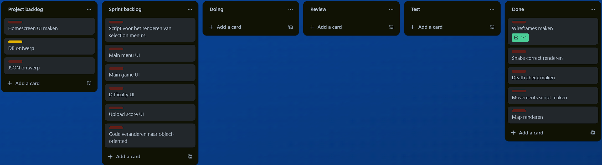
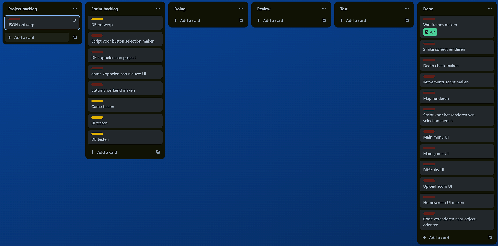
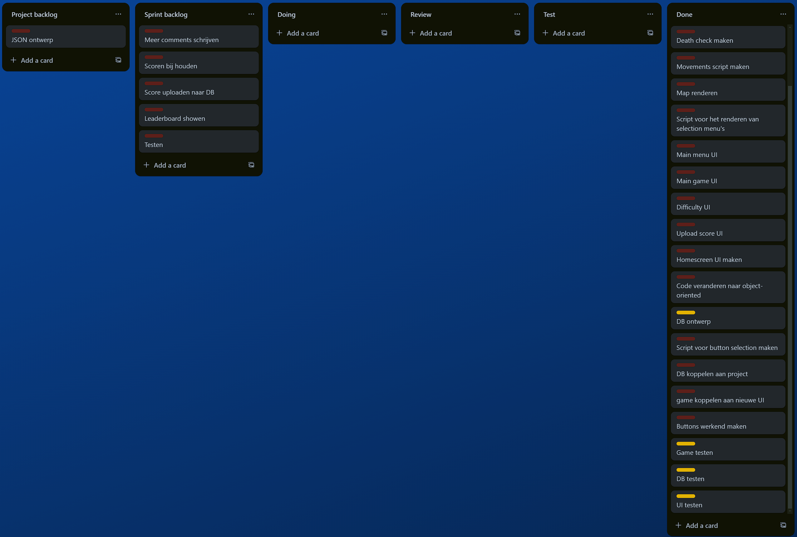
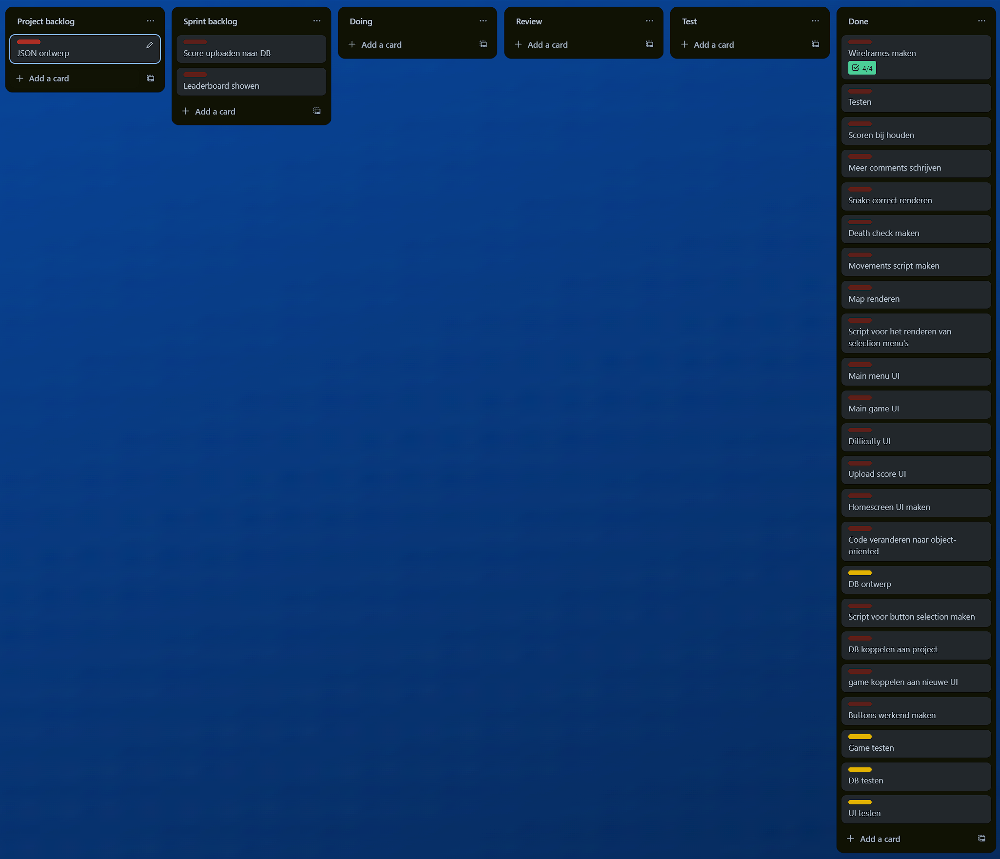

# Snake Game

**Gemaakt door:** Sam Maijer, Sadek Al Mousawi en Daniel Pustjens

---

## De 3 algorithmes
- In het bestand UI.cs op lijn 4 hebben wij een algorithme gemaakt op basis van een lijst en input keys een selectie tekent naar het scherm met indicatie van het huidige geselecteerde item om te navigeren door de applicatie.
- In het bestand Snake.cs op lijn 74 hebben wij een while loop gemaakt die op basis van user input de directie van de snake verandert en tekent. Ook wordt de staart verwijderd als er geen appel wordt gegeten.
- In het bestand Snake.cs op lijn 180 hebben wij een algorithme gemaakt dat de apple opnieuw spawnt nadat hij is opgegeten door de snake. Dit doet hij op basis van random getallen, Dat hij niet op de locatie van de snake spawnt en dat hij binnen de map is.

---

## Creative oplossing
### In het bestand UI.cs op lijn 4 hebben wij een functie gemaakt die voor elk UI element de selectie kan genereren / handelen op basis van een Tuple list die wordt mee gegeven waneer de functie wordt aangeroepen.  

---

## Trello Bord

### Na eerste sprint

---

### Na tweede sprint

---

### Na derde sprint

---

### Eindstand

